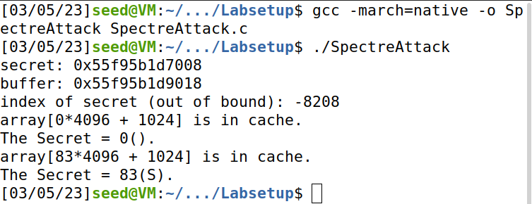

# Spectre Attack Lab

[https://seedsecuritylabs.org/Labs_20.04/System/Spectre_Attack/](https://seedsecuritylabs.org/Labs_20.04/System/Spectre_Attack/)

## Work

Part of the **SSI Course Unit** at [FEUP](https://sigarra.up.pt/feup/en/WEB_PAGE.INICIAL).

**Team** (Group 3):

- João Pedro Rodrigues da Silva [[up201906478]](mailto:up201906478@edu.fe.up.pt);
- António Bernardo Linhares Oliveira [[up202204184]](mailto:up202204184@edu.fe.up.pt);
- Fernando Adriano Ramalho Rocha [[up202200589]](mailto:up202200589@edu.fe.up.pt).

The group has followed the instructions on the lab page, and has documented the process as well as the answers to the questions indicated in the lab tasks.

## Task 1: Reading from Cache versus from Memory

The cache memory is faster than the main memory. The goal of this task is to observe and take conclusions on the time difference in terms of providing data.

We start by compiling and running the *CacheTime.c* file 10 times.

The results we obtained in terms of memory access time (measured in CPU cycles) are the following:

| Element [k*4096]     | Time (1) | Time (2) | Time (3) | Time (4)     | Time (5) | Time (6)  | Time (7) | Time (8)  | Time (9) | Time (10)  | Average Time Taken |  
| :----:       |  :----:  |   :----: |  :----:  |    :----:    |   :----: |  :----:   |  :----:  |   :----:  | :----:   |   :----:   |       :----:       |
| A[0]      | 132    | 138|1290    | 120        | 124 |160     | 100    | 126|  104    | 174| **245**       |
| A[1]       |  260   | 860|372    | 304       | 418| 232     | 282    | 242| 288     | 1174| **443**        |
| A[2]       | 300    | 392|374    | 334        | 268|256     | 256    | 416| 264     | 278|   **314**   |
| A[3]       | 60    | 114|432    | 102        | 114|118     | 154    | 234| 124     | 168|      **162**   |
| A[4]       | 228    | 960| 304   | 240        | 262 |202     |  270   | 428| 260    | 308|      **346**   |
| A[5]       |   232  | 216|308    |  340       | 256|  282   | 200    | 422| 234     | 282|      **277**   |
| A[6]       | 216    | 252|214    |    234     | 274|  206    | 266    | 448| 276     | 390 |      **278**   |
| A[7]       | 86    | 122|138    |     114    | 134| 140     | 124    | 278| 114     | 168 |      **142**   |
| A[8]       | 296    | 230|512    | 236       | 260| 238     |  234  | 372| 278     |  306| **296**         |
| A[9]       | 244   | 260|272    | 246        | 270|  236    | 250    | 420| 240     | 274| **295**        |

As we can observe the access time of *array[3*4096]* and *array[7*3096]* are faster than that of other elements. This is because we are accessing them from the cache (cache hit).

The treshold the team defined to distinguish the two types of memory access is 130 CPU cycles. In our team, this proved to be adequate for all our setups.

## Task 2: Using Cache as a Side Channel

In this task we will use the FLUSH+RELOAD technique to perform a side channel attack to steal a protected secret.

We changed the *CACHE_HIT_THRESHOLD* variable to the value previously chosen (130) and ran the program 20 times. We noted that the secret was correctly output all the times (94).

## Task 3: Out-of-Order Execution and Branch Prediction

In this task the *SpectreExperiment.c* program was used to cause an out-of-order execution. The CPU was trained to assume x < size as true so that line 2 (*array[97 * 4096 + DELTA]*) is executed even if the if condition isn't verified. When the script was executed this proved to be true since the key array was present in the cache.
Consequently, the line marked with a star (*\_mm\_clflush(&size);*) was commented. This line flushes variable *size* from memory and causes the cpu to take longer in the retrieval of its value. This caused the attack to not succeed, the value was not flushed so the cpu could retrieve *size* and didn't have the need to assume its value as larger than x.
astly, line 4 (*victim(i);*) was replace with *victim(i + 20)*. This time the CPU wasn't trained to assume the if condition (*if (x < size)*) as true. This causes line 2 (*temp = array[x * 4096 + DELTA]*) to not be executed and the array to not be stored in cache.

## Task 4: The Spectre Attack

From the previous tasks we could observe that some of the signs of the out-of-order execution are left behind, mainly not cleaning the CPU cache.

The Spectre attack uses this to steal protected secrets.

The goal for this task is to perform a basic Spectre attack and observe if we are able to steal the secret value.

After compiling and running the *SpectreAttack.c* file we can observe that we were in fact able to steal the first byte of our secret value, in this case the letter *S* represented in the form of ascii code: 83.

The value zero is also returned since all the steps of the out-of-order execution will be eventually reverted and *restrictedAccess()* therefore returns zero, that in fact is not the value of the secret.

The results of this experiment can be seen below:



## Task 5: Improve the Attack Accuracy

We compiled and ran *SpectreAttackImproved.c* at least 10 times after setting the *CACHE_HIT_THRESHOLD* variable to 130.

We noted that the value 0 is returned as the secret due to having the highest score. This happens because, as explained in Task 4, the function *restrictedAccess()* returns 0 when the if condition is false, being stored in the cache due to speculative execution.

We fixed this by excluding the value 0 from the loop at line 94:

```c
int max = 1;
for (i = 1; i < 256; i++) {
    if (scores[max] < scores[i]) max = i;
}
```

The secret value returned is always 83(S).

It's remarkable that without the line *printf("*****\n")* the attack will not work. This line appears to be a way to synchronize the execution of the attack and ensure that the victim code is in a consistent state at the beginning of each iteration of the attack loop. Without this line, the timing of the attack could be affected by unpredictable factors such as the state of the CPU pipeline or the timing of interrupts from other processes.

The *usleep(10)* call immediately after the attack also serves to give the victim code time to recover from any speculative execution before the next iteration of the attack. In our case, we tested with values of 1, 10, 50 and 100 and always had success retrieving the secret value. In theory, this sleep value should be calibrated but it is not necessary to be very precise, as long as the sleep value is long enough to ensure that the victim code has recovered.

## Task 6: Steal the Entire Secret String

To reveal the secret value, the following code was used to print all the characters of the secret string to the file *secret.txt*.

```c
int main() {
    FILE *fp;
    fp = fopen("secret.txt", "w+");
    int i;
    uint8_t s;
    size_t index_beyond = (size_t)(secret - (char*)buffer);
    for(int m = 0; m < strlen(secret); m++) {
    flushSideChannel();
        for(i=0;i<256; i++) scores[i]=0;
    for (i = 0; i < 1000; i++) {
        printf("*****\n");
        spectreAttack(index_beyond + m);
        usleep(10);
        reloadSideChannelImproved();
    }
        int max = 1;
    for (i = 1; i < 256; i++){
        if(scores[max] < scores[i]) max = i;
    }
    //fprintf(fp, "Reading secret value at index %ld\n", index_beyond);
    fprintf(fp, "%c", max, max);
    //fprintf(fp, "The number of hits is %d\n", scores[max]);
    }
    return 0;
}
```

The result was printed to a file because of the need to include line *printf("*****\n")* which floods the output but it's necessary in order for the attack to succeed.

The file *secret.txt* now contains the text: `Some Secret Value`.
