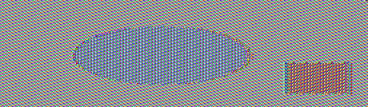

# Secret Key Encryption Lab

[https://seedsecuritylabs.org/Labs_20.04/Crypto/Crypto_Encryption/](https://seedsecuritylabs.org/Labs_20.04/Crypto/Crypto_Encryption/)

## Work

Part of the **SSI Course Unit** at [FEUP](https://sigarra.up.pt/feup/en/WEB_PAGE.INICIAL).

**Team** (Group 3):

- João Pedro Rodrigues da Silva [[up201906478]](mailto:up201906478@edu.fe.up.pt);
- António Bernardo Linhares Oliveira [[up202204184]](mailto:up202204184@edu.fe.up.pt);
- Fernando Adriano Ramalho Rocha [[up202200589]](mailto:up202200589@edu.fe.up.pt).

The group has followed the instructions on the lab page, and has documented the process as well as the answers to the questions indicated in the lab tasks.

## Task 1: Frequency Analysis

In this task the objective is to find the original text behind a cipher-text and the encription key using frequency analysis.

Portion of the original Cipher text:

```console
ytn xqavhq yzhu  xu qzupvd ltmat qnncq vgxzy hmrty vbynh ytmq ixur qyhvurn
vlvhpq yhme ytn gvrrnh bnniq imsn v uxuvrnuvhmvu yxx

ytn vlvhpq hvan lvq gxxsnupnp gd ytn pncmqn xb tvhfnd lnmuqynmu vy myq xzyqny
vup ytn veevhnuy mceixqmxu xb tmq bmic axcevud vy ytn nup vup my lvq qtvenp gd
ytn ncnhrnuan xb cnyxx ymcnq ze givasrxlu eximymaq vhcavupd vaymfmqc vup
v uvymxuvi axufnhqvymxu vq ghmnb vup cvp vq v bnfnh phnvc vgxzy ltnytnh ytnhn
xzrty yx gn v ehnqmpnuy lmubhnd ytn qnvqxu pmpuy ozqy qnnc nkyhv ixur my lvq
nkyhv ixur gnavzqn ytn xqavhq lnhn cxfnp yx ytn bmhqy lnnsnup mu cvhat yx
vfxmp axubimaymur lmyt ytn aixqmur anhncxud xb ytn lmuynh xidcemaq ytvusq
ednxuratvur
```

First, we ran the *freq.py* file to receive the statistics for n-grams present in the cipher text.

The partial oredered results that we obtained were:

- 1-gram: 'n', 'y', 'v'
- 2-gram: 'yt', 'tn', 'mu'
- 3-gram: 'ytn','vup','mur'

According to the resources given by the lab guide related to frequency analysis, the letter 'e' is at the top of the distribution of letters in the english language so the letter 'e' should correspond to the letter 'n' in the cipher text. Also, the top bigram is 'th' so that should correspond to the letters 'yt'.

Making this changes in the cipher text we reach this partial result:

So we know that 'y' should be letter 't' and 't' equals 'h'. Next, we look at the 1-gram 'v', 2-grams 'tn', 'mu', 3-grams 'vup', 'mur'.

- 'tn' -> 'he'
- 'v' -> 'a' as 'a' is the third letter at the top of the frequency distribution in the english language.
- 'mu' -> 'in' as 'in' is the third bigram to appear in the bigram frquency.
- That leads us to 'vup' -> 'and'.

Making this changes in the cipher text we reach this partial result:

```console
THE xqaAhq TzhN  xN qzNDAd lHIaH qEEcq AgxzT hIrHT AbTEh THIq ixNr qThANrE
AlAhDq ThIe THE gArrEh bEEiq iIsE A NxNArENAhIAN Txx

THE AlAhDq hAaE lAq gxxsENDED gd THE DEcIqE xb HAhfEd lEINqTEIN AT ITq xzTqET
AND THE AeeAhENT IceixqIxN xb HIq bIic axceANd AT THE END AND IT lAq qHAeED gd
THE EcEhrENaE xb cETxx TIcEq ze giAasrxlN exiITIaq AhcaANDd AaTIfIqc AND
A NATIxNAi axNfEhqATIxN Aq ghIEb AND cAD Aq A bEfEh DhEAc AgxzT lHETHEh THEhE
xzrHT Tx gE A ehEqIDENT lINbhEd THE qEAqxN DIDNT ozqT qEEc EkThA ixNr IT lAq
EkThA ixNr gEaAzqE THE xqaAhq lEhE cxfED Tx THE bIhqT lEEsEND IN cAhaH Tx
AfxID axNbiIaTINr lITH THE aixqINr aEhEcxNd xb THE lINTEh xidceIaq THANsq
edExNraHANr
```

Having some partial words completed we have know more clues and looking at the frequency distribution resources we can finally complete our plain text discovery and find the encription key:

```console
THE OSCARS TURN  ON SUNDAY WHICH SEEMS ABOUT RIGHT AFTER THIS LONG STRANGE
AWARDS TRIP THE BAGGER FEELS LIKE A NONAGENARIAN TOO

THE AWARDS RACE WAS BOOKENDED BY THE DEMISE OF HARVEY WEINSTEIN AT ITS OUTSET
AND THE APPARENT IMPLOSION OF HIS FILM COMPANY AT THE END AND IT WAS SHAPED BY
THE EMERGENCE OF METOO TIMES UP BLACKGOWN POLITICS ARMCANDY ACTIVISM AND
A NATIONAL CONVERSATION AS BRIEF AND MAD AS A FEVER DREAM ABOUT WHETHER THERE
OUGHT TO BE A PRESIDENT WINFREY THE SEASON DIDNT JUST SEEM EXTRA LONG IT WAS
EXTRA LONG BECAUSE THE OSCARS WERE MOVED TO THE FIRST WEEKEND IN MARCH TO
AVOID CONFLICTING WITH THE CLOSING CEREMONY OF THE WINTER OLYMPICS THANKS
PYEONGCHANG
```

## Task 2: Encryption using Different Ciphers and Modes

In this task the objective is to play with various encryption algorithms and modes.

More specifically we tried three different cipher types: *-aes-128-cbc, -bf-cbc,-aes-128-cfb*

*Out10.txt* being our output file from the previous task.

- 128 bit Advanced Encryption Service in Cipher Block Chaining Mode:

```console
openssl enc -aes-128-cbc -e -in out10.txt -out cipher.bin \
-K 00112233445566778889aabbccddeeff \
-iv 01020304050607080102030405060708

```

- Blowfish in Cipher Block Chaining Mode:

```console
openssl enc -bf-cbc -e -in out10.txt -out cipher.bin \
-K 00112233445566778889aabbccddeeff \
-iv 0102030405060708
```

- 128 bit Advanced Encryption Service in Cipher Feedback Mode:

```console
openssl enc -aes-128-cfb -e -in out10.txt -out cipher.bin \
-K 00112233445566778889aabbccddeeff \
-iv 01020304050607080102030405060708
```

Each of this commands produces a output file *cipher.bin* encrypted by each algorithm in a certain mode.

## Task 3: Encryption Mode – ECB vs. CBC

For reference, we will be encrypting this image: `pic_original.bmp`


We start by encrypting the picture with ECB (Electronic Code Book) using:

```bash
openssl enc -aes-128-ecb -e -in pic_original.bmp -out pic_original_ecb.bmp -K 00112233445566778889aabbccddeeff # same key used in Task 2
```

We then use the following commands to preserve the header from the original BMP file, and keep the encrypted body so we can view it:

```bash
head -c 54 pic_original.bmp > header
tail -c +55 pic_original_ecb.bmp > body_cb
cat header body_cb > new_ecb.bmp
```



Same process but with CBC (Cipher Block Chaining):

```bash
openssl enc -aes-128-cbc -e -in pic_original.bmp -out pic_original_cbc.bmp -K 00112233445566778889aabbccddeeff -iv 01020304050607080102030405060708 # same key and IV used in Task 2
```

```bash
tail -c +55 pic_original_cbc.bmp > body_cbc
cat header body_cbc > new_cbc.bmp
```


The two shapes in the encrypted image are still clearly distinguishable when utilizing the ECB mode. This occurs because each ciphertext block in this mode is created by immediately applying the DES encryption process to the current plaintext block. Hence, there is no dependency between the present ciphertext block and any earlier plaintext blocks. This results in a significant drawback of this mode since similar plaintext blocks are converted to identical ciphertext blocks, which does not effectively conceal data patterns. Because of this, ECB mode offers no message confidentiality and is not advised for use with cryptographic protocols.

But, when utilizing the CBC method, the encrypted image is undetectable, making it impossible for someone without the encryption keys to decipher what is inside. In this method, the initialization vector (IV), which is a block of random bits of plaintext, is exclusive-OR'd (XOR'd) with the first block of the plaintext before the encryption key is applied. The first block of the ciphertext is the resulting block. The phrase "chaining" refers to the process of XORing each next block of plaintext with the one before it, followed by encryption. The same block of plaintext will no longer generate identical ciphertext as a result of this XOR operation.

---

The same experiment was repeated with a picture of FEUP to demonstrate this effect again.


ECB mode:


CBC mode:


## Task 4: Padding

- The modes that require padding are _EBC_ and _CBC_, while _CBF_ and _OBF_ do not. This happens because the first two modes need the key to be a multiple of the ciphers block size, for AES is 16 bytes. In contrary, the last two mentioned modes can encrypt and decrypt messages of any size, eliminating the need of fulfilling the previous condition and thus the necessity of using padding.

All of the encrypted files of 5, 10 and 15 bytes were respectivelly padded in order for their size to be a multiple of 16 during the AES encryption with the CBC mode.

- 5 bytes -> 16 bytes
- 10 bytes -> 16 bytes
- 16 bytes -> 32 bytes

Interestingly, the last file already had size 16 but was still padded with 16 bytes. This is because of PKCS padding rules that state that there must always be padding applied.

After decryption with the special flag *-nopad* to prevent the removal of padding it was observed that the algorithm used the size of padding in bytes as the padding byte for each file respectively, the first used 0b which is 11 in hexadecimal, second was 06 which is 6 and third was 10 for 16.

```console
earth ~/desktop/Labsetup % hexdump -C five.new
00000000  31 32 33 34 35 0b 0b 0b  0b 0b 0b 0b 0b 0b 0b 0b  |12345...........|
00000010
earth ~/desktop/Labsetup % hexdump -C ten.new
00000000  30 31 32 33 34 35 36 37  38 39 06 06 06 06 06 06  |0123456789......|
00000010
earth ~/desktop/Labsetup % hexdump -C sixteen.new
00000000  31 31 32 32 33 33 34 34  35 35 36 36 37 37 38 38  |1122334455667788|
00000010  10 10 10 10 10 10 10 10  10 10 10 10 10 10 10 10  |................|
00000020
```

## Task 5: Error Propagation – Corrupted Cipher Text

- Create a file with at least 1000 bytes.

- Encrypt it with AES-128 cipher.

```console
openssl enc -aes-128-... -e -in 1000bytes.txt -out cipherCorrupt.bin \
-K 00112233445566778889aabbccddeeff \
-iv 01020304050607080102030405060708
```

- Corrupt one byte (55th) using the Hess editor.

- Decrypt the corruption file using these four encryption modes.

```console
openssl enc -aes-128-... -d -in cipherCorrupt.bin -out outText.txt \
-K 00112233445566778889aabbccddeeff \
-iv 01020304050607080102030405060708
```

- Before executing task:

### ECB encryption mode

- Before executing task:

In ECB, the input plaintext is broken into numerious blocks and then each block is encrypted using a encryption key. So if a single byte in the cipher text is corrupted then only the corresponding plain text block is corrupted, the rest of the plain text is correct.

- Final answer:

After executing the task we verified that our answer before was correct since only the corresponding plain text block to the corrupt cipher block was corrupted.
The corrupted byte will affect only the decrypted block and not the rest of the file.

### CBC encryption mode

- Before executing task:

We assume that since CBC uses the current block as input for the next block, decrypting a corrupted file may lead to more extensive damage than ECB mode (corrupt the rest of the plain text blocks).

- Final answer:

Our answer before executing the task was going in fact in the wrong direction since the CBC the corruption only propagates at most to two blocks.
As you only need the current and previous block for decryptin in CBC mode, the effect of a changed byte in the ciphertext, would only affect the present block and the following block.

### CFB encryption mode

- Before executing task:

In CFB mode, a previous ciphertext block is encrypted and then combined with the plain text block to produce the next ciphertext block. Each ciphertext block depends on the previous one. Since the corruption size is 1 byte the decryption process can  recover all of the information that was not affected by the corruption which means that only the portion of the file up to the corrupted block will be recovered.

- Final answer:

Our answer was the correct one, using the CFB mode the corruption propagates to the rest of the blocks as the initial value for the feedback mechanism will be incorrect, leading to the incorrect decryption of the rest of the file.

### OFB encryption mode

- Before executing task:

In OFB mode, the encryption process generates a key stream that is XORed with the plain text to produce the ciphertext. The key stream is generated independently of the plaintext. Since the corruption is only one byte on the cipher block that means that the corruption will not occur in other plain text blocks as the cipher block is not shared.

- Final answer:

Our answer was the correct since the corruption didn't propagate for reasons explained above.

## Task 6: Initial Vector (IV) and Common Mistakes

### Task 6.1. IV Experiment

We create `lorem.txt` which contains some Lorem Ipsum text.

```bash
# different IVs
openssl enc -aes-128-cbc -e -in lorem.txt -out lorem_cbc1.txt -K 00112233445566778889aabbccddeeff -iv 01020304050607080102030405060708
openssl enc -aes-128-cbc -e -in lorem.txt -out lorem_cbc2.txt -K 00112233445566778889aabbccddeeff -iv 01020304050607080102030405060709
cmp -lb lorem_cbc1.txt lorem_cbc2.txt | wc -l # result: 2979 different bytes

# same IV
openssl enc -aes-128-cbc -e -in lorem.txt -out lorem_cbc3.txt -K 00112233445566778889aabbccddeeff -iv 01020304050607080102030405060708
openssl enc -aes-128-cbc -e -in lorem.txt -out lorem_cbc4.txt -K 00112233445566778889aabbccddeeff -iv 01020304050607080102030405060708
cmp -lb lorem_cbc3.txt lorem_cbc4.txt | wc -l # result: 0 different bytes
```

We can see the importance of using a different and unique IV for each encryption. If the same IV is used, the same ciphertext will be generated for the same plaintext.

### Task 6.2. Common Mistake: Use the Same IV

We will now exploit an in OFB (Output Feedback) mode which is possible when the attacker knows the plaintext and its encrypted version, being able to decipher other encrypted messages.

In this case, the same IV key is used so we can calculate the XOR between the plaintext given and its ciphertext. This XOR operation will give us the secret key used to encrypt the plaintext. We then XOR this value with the ciphertext of the message we want to decrypt to get the plaintext of that message. The final step is converting the result to ASCII so we can read it. Here is the modified `sample_code.py` script:

```py
#!/usr/bin/python3

# XOR two bytearrays
def xor(first, second):
   return bytearray(x^y for x,y in zip(first, second))

MSG   = "This is a known message!"
HEX_1 = "a469b1c502c1cab966965e50425438e1bb1b5f9037a4c159"
HEX_2 = "bf73bcd3509299d566c35b5d450337e1bb175f903fafc159"

# Convert ascii string to bytearray
D1 = bytes(MSG, 'utf-8')

# Convert hex string to bytearray
D2 = bytearray.fromhex(HEX_1)
D3 = bytearray.fromhex(HEX_2)

r1 = xor(D1, D2)
r2 = xor(r1, D3)
print("Secret key: ", r1.hex())
print("Plaintext: ", bytes.fromhex(r2.hex()).decode("ASCII", "replace"))
# Result secret message found:
# Order: Launch a missile!
```

If we replace OFB with CFB (Ciber Feedback) mode, we will not be able to find the full message because in CFB, the IV key is only used in the first block, and the next blocks use the resultant ciphertext of the previous.

### Task 6.3. Common Mistake: Use a Predictable IV

This is the logic of the "encryption oracle" program provided:

- We know Bob's message will always be "Yes" or "No". When we run the program, it gives us the initial ciphertext and IV. And, we get the IV used in the next encryption.
- In this case, we can perform a chosen plaintext attack by using both of these IVs to find what Bob's message is.
- We calculate the XOR between the 1st IV and 2nd IV, and then with our guessed message (Yes or No). This gives us a plaintext that we'll give to the program.
- It will yield a resulting ciphertext, and we can easily see that if it is identical to the initial given ciphertext, then we guessed the correct message.

Note: when encoding our predicted message (e.g. Yes), we needed to add padding to complete a block of 16 bytes. This is because AES uses 128-bits (16 bytes) blocks.

Code used for this experiment:

```py
#!/usr/bin/python3

# XOR two bytearrays
def xor(first, second):
    return bytearray(x^y for x,y in zip(first, second))

MSG   = "Yes"
IV1   = "248b724e5f1206067adaf98cd2b3462f"
IV2   = "945bb7b25f1206067adaf98cd2b3462f"

# Convert ascii string to bytearray
bMSG = bytes(MSG, 'utf-8')

# Add padding
psize = 16 - len(MSG)
bMSG += bytearray((psize,)) * psize

# Convert hex string to bytearray
bIV1 = bytearray.fromhex(IV1)
bIV2 = bytearray.fromhex(IV2)

sK = xor(bIV1, bIV2)
cMSG = xor(sK, bMSG)

print("Secret key: ", sK.hex())
print("Plaintext hex:", cMSG.hex()) # Input to the program
```

The plaintext (HEX) resultant of that script is input to the program. The first 16 bytes of the ciphertext it responded with were the same as the initial ciphertext given by the program. This means that the initial message was indeed "Yes".

## Task 7: Programming using the Crypto Library

To find the encryption key used in the provided context, the following function was built and executed:

```py
from Crypto.Cipher import AES
from Crypto.Util.Padding import pad, unpad


def find_key(plaintext, ciphertext, wordlist, iv):

    plaintext = pad(plaintext.encode(), AES.block_size)
    biv = bytearray.fromhex(iv)
    
    for word in wordlist:
        key = word.rstrip('\n')
        key += '#' * (17 - len(word))
        key = bytes(key, 'utf-8')
        if(len(key) > 16):
            continue
        cipher = AES.new(key, AES.MODE_CBC, biv)
        enc_text = cipher.encrypt(plaintext)
        if(enc_text.hex() == ciphertext):
            return word

    return None

plaintext = "This is a top secret."
ciphertext = "764aa26b55a4da654df6b19e4bce00f4ed05e09346fb0e762583cb7da2ac93a2"
iv = "aabbccddeeff00998877665544332211"
dictionary = open('./4-Secret-Key-Encryption/Labsetup/Files/words.txt', 'r')

words = dictionary.readlines()

res = find_key(plaintext, ciphertext, words, iv)

if(res == None):
    print("No key was found in wordlist.")
else:
    print("The key is: " + str(res))

```

The steps it takes to fullfil our goal is, firstly, to pad the given message to the AES block size and convert the initialization vector from hex to a byte array.  
Consequently, the given wordlist is iterated and the provided plaintext is encrypted with AES CBC mode for each word (after padding) and using the converted initialization vector, once the encrypted text matches that of the cipher text provided the key is found.

```console
The key is: Syracuse
```
