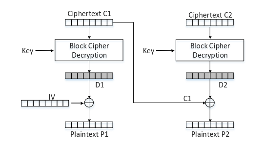
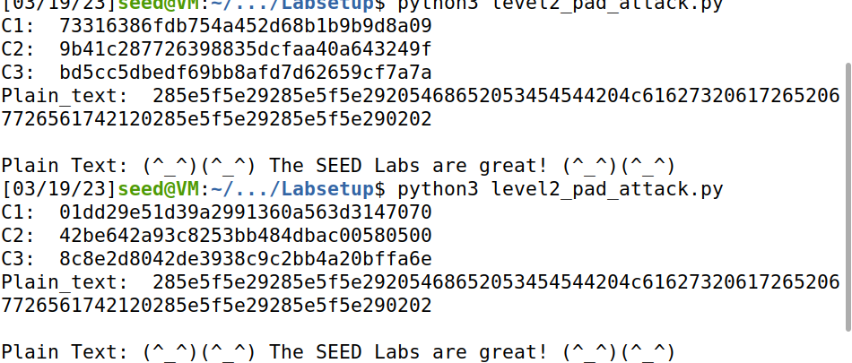

# Padding Oracle Attack Lab

[https://seedsecuritylabs.org/Labs_20.04/Crypto/Crypto_Padding_Oracle/](https://seedsecuritylabs.org/Labs_20.04/Crypto/Crypto_Padding_Oracle/)

## Work

Part of the **SSI Course Unit** at [FEUP](https://sigarra.up.pt/feup/en/WEB_PAGE.INICIAL).

**Team** (Group 3):

- João Pedro Rodrigues da Silva [[up201906478]](mailto:up201906478@edu.fe.up.pt);
- António Bernardo Linhares Oliveira [[up202204184]](mailto:up202204184@edu.fe.up.pt);
- Fernando Adriano Ramalho Rocha [[up202200589]](mailto:up202200589@edu.fe.up.pt).

The group has followed the instructions on the lab page, and has documented the process as well as the answers to the questions indicated in the lab tasks.

## Task 1: Getting Familiar with Padding

We experimented with Padding on the previous seedlab (Secret Key Encryption - Task 4) but, just to demonstrate, here are our findings.

We created three files which contain 5 bytes, 10 bytes, and 16 bytes, respectively. We encrypted them all using 128-bit AES with CBC mode.

```bash
echo -n "12345" > F5
echo -n "1234567890" > F10
echo -n "1234567890123456" > F16

openssl enc -aes-128-cbc -e -in F5 -out F5.enc -K 00112233445566778889aabbccddeeff -iv 01020304050607080102030405060708
openssl enc -aes-128-cbc -e -in F10 -out F10.enc -K 00112233445566778889aabbccddeeff -iv 01020304050607080102030405060708
openssl enc -aes-128-cbc -e -in F16 -out F16.enc -K 00112233445566778889aabbccddeeff -iv 01020304050607080102030405060708
```

We obtain three files with 16, 16 and 32 bytes, respectively. In the last file, padding occurred even though the file's size was already a multiple of the block size, and the encrypted file ultimately had the size of the following multiple of the AES block size, in this case 32. This occurs as a result of the PKCS padding rules' requirement that padding always be used.

Using the -no-pad option, we decrypted the three files without removing the padding that had been added, and then we checked that the sum of the values of each padding byte matched the number of padding bytes added.

```bash
openssl enc -aes-128-cbc -d -nopad -in F5.enc -out F5.dec -K 00112233445566778889aabbccddeeff -iv 01020304050607080102030405060708
openssl enc -aes-128-cbc -d -nopad -in F10.enc -out F10.dec -K 00112233445566778889aabbccddeeff -iv 01020304050607080102030405060708
openssl enc -aes-128-cbc -d -nopad -in F16.enc -out F16.dec -K 00112233445566778889aabbccddeeff -iv 01020304050607080102030405060708

hexdump -C F5.dec
# Result:
# 00000000  31 32 33 34 35 0b 0b 0b  0b 0b 0b 0b 0b 0b 0b 0b  |12345...........|

hexdump -C F10.dec
# Result:
# 00000000  31 32 33 34 35 36 37 38  39 30 06 06 06 06 06 06  |1234567890......|

hexdump -C F16.dec
# Result:
# 00000000  31 32 33 34 35 36 37 38  39 30 31 32 33 34 35 36  |1234567890123456|
# 00000010  10 10 10 10 10 10 10 10  10 10 10 10 10 10 10 10  |................|
```

## Task 2: Padding Oracle Attack (Level 1)

To perform this attack, we start by iterating all the possible values of the last byte of the first block of the cyphertext (C1[15]) in order to find the value for which the padding is valid according to the oracle.



The point is to force the cyphertext to decrypt to a plaintext message with a padding of one byte in order to determine the true last byte of plain text. When this value is determined (CC1[15]) the value of D2[15] can be calculated using the expression D2 = PAD ⊕ CC1 and P2 = C1 ⊕ D2.

From this step, we repeat the same for each byte incrementing the padding and using the expression CC1 = PAD ⊕ D2 to calculate the new CC1 each time, bellow we can observe the values for 9 iterations with the purpose of decrypting 9 bytes of the message (3 bytes of padding and 6 of plaintext).

```py
# CC1 = PAD xor D2

# Iteration 2
    CC1[15] = 0xcc # 0x02 xor 0xce

# Iteration 3
    CC1[15] = 0xcd # 0x03 xor 0xce
    CC1[14] = 0x38 # 0x03 xor 0x3b

# Iteration 4
    CC1[15] = 0xca # 0x04 xor 0xce
    CC1[14] = 0x3f # 0x04 xor 0x3b
    CC1[13] = 0xf5 # 0x04 xor 0xf1

# Iteration 5
    CC1[15] = 0xcb # 0x05 xor 0xce
    CC1[14] = 0x3e # 0x05 xor 0x3b
    CC1[13] = 0xf4 # 0x05 xor 0xf1
    CC1[12] = 0x19 # 0x05 xor 0x1c

# Iteration 6
    CC1[15] = 0xc8 # 0x06 xor 0xce
    CC1[14] = 0x3d # 0x06 xor 0x3b
    CC1[13] = 0xf7 # 0x06 xor 0xf1
    CC1[12] = 0x1a # 0x06 xor 0x1c
    CC1[11] = 0x43 # 0x06 xor 0x45

# Iteration 7
    CC1[15] = 0xc9 # 0x07 xor 0xce
    CC1[14] = 0x3c # 0x07 xor 0x3b
    CC1[13] = 0xf6 # 0x07 xor 0xf1
    CC1[12] = 0x1b # 0x07 xor 0x1c
    CC1[11] = 0x42 # 0x07 xor 0x45
    CC1[10] = 0xeb # 0x07 xor 0xec

# Iteration 8
    CC1[15] = 0xc6 # 0x08 xor 0xce
    CC1[14] = 0x33 # 0x08 xor 0x3b
    CC1[13] = 0xf9 # 0x08 xor 0xf1
    CC1[12] = 0x14 # 0x08 xor 0x1c
    CC1[11] = 0x4d # 0x08 xor 0x45
    CC1[10] = 0xe4 # 0x08 xor 0xec
    CC1[9] = 0x92 # 0x08 xor 0x9a

# Iteration 9
    CC1[15] = 0xc7 # 0x09 xor 0xce
    CC1[14] = 0x32 # 0x09 xor 0x3b
    CC1[13] = 0xf8 # 0x09 xor 0xf1
    CC1[12] = 0x15 # 0x09 xor 0x1c
    CC1[11] = 0x4c # 0x09 xor 0x45
    CC1[10] = 0xe5 # 0x09 xor 0xec
    CC1[9] = 0x93 # 0x09 xor 0x9a
    CC1[8] = 0xc2 # 0x09 xor 0xcb

    
# D2 = PAD xor CC1
    D2[15] = 0xce # 0x01 xor 0xcf
    D2[14] = 0x3b # 0x02 xor 0x39
    D2[13] = 0xf1 # 0x03 xor 0xf2
    D2[12] = 0x1c # 0x04 xor 0x18
    D2[11] = 0x45 # 0x05 xor 0x40
    D2[10] = 0xec # 0x06 xor 0xea
    D2[9] = 0x9a # 0x07 xor 0x9d
    D2[8] = 0xcb # 0x08 xor 0xc3
    D2[7] = 0x08 # 0x09 xor 0x01
```

This makes our program output the true decrypted last 6 bytes of text, by xoring D2 and C1:

```console
...
P2:  0000000000000088aabbccddee030303
```

## Task 3: Padding Oracle Attack (Level 2)

In this task the objective is to automate the process done in the previous task to find out all blocks of the plaintext.

Since the level-2 server listens to port 6000 we had access to one more 16 byte block of ciphertext, so we added the C3 variable to keep the extra block:

```python

    oracle = PaddingOracle('10.9.0.80', 6000)

    # Get the IV + Ciphertext from the oracle
    iv_and_ctext = bytearray(oracle.ctext)
    IV    = iv_and_ctext[00:16]
    C1    = iv_and_ctext[16:32]  # 1st block of ciphertext
    C2    = iv_and_ctext[32:48]  # 2nd block of ciphertext
    C3    = iv_and_ctext[48:64]  # 3nd block of ciphertext

```

Our approach to this task was to write a python algorithm to derive all the blocks of the secret message in one run. For this a list of lists containing pairs of the blocks used in each iteration was created:

```py
    blocks = [[C3,C2],[C2,C1],[C1,IV]]
```

So the algorithm focus on iterating through these pairs of blocks since each one is used to decipher the next one.

In the algorithm we used the following calculations to discover the secret byte and the CC1 byte to use in next iteration:

`Secret =  D2  ^ PreviousBlock`, with  `D2 -> valid_i(0...255) ^ bit(1...16)`

`CC1[index] =  D2[index]  ^ Next_padding`

This results in the following code to perform the automated attack:

```py

    blocks = [[C3,C2],[C2,C1],[C1,IV]]
    
    for [input_block, xor_block] in blocks:
        for bit in range(1,17):
            for i in range(256):
                CC1[16 - bit] = i
                status = oracle.decrypt(IV + CC1 + input_block)
                if status == "Valid":
                    D2[16-bit] = i ^ bit
                    secret[16-bit] = D2[16-bit] ^ xor_block[16-bit]
                    next_pad = bit + 1
                    for rev_index in range(1,next_pad):
                        CC1[16 - rev_index] = next_pad ^ D2[16-rev_index]
                    break
        Plain_text = secret.hex() + Plain_text
```

Executing the attack it leads us to the secret message, even after a new connection to the oracle:


