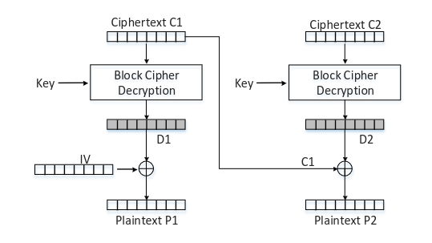

# Task 2

To perform this attack, we start by iterating all the possible values of the last byte of the first block of the cyphertext (C1[15]) in order to find the value for which the padding is valid according to the oracle.



The point is to force the cyphertext to decrypt to a plaintext message with a padding of one byte in order to determine the true last byte of plain text. When this value is determined (CC1[15]) the value of D2[15] can be calculated using the expression D2 = PAD ⊕ CC1 and P2 = C1 ⊕ D2. 
From this step, we repeat the same for each byte incrementing the padding and using the expression CC1 = PAD ⊕ D2 to calculate the new CC1 each time, bellow we can observe the values for 6 iterations.


```python
# CC1 = PAD xor D2

# Iteration 2
    CC1[15] = 0xcc # 0x02 xor 0xce

# Iteration 3
    CC1[15] = 0xcd # 0x03 xor 0xce
    CC1[14] = 0x38 # 0x03 xor 0x3b

# Iteration 4
    CC1[15] = 0xca # 0x04 xor 0xce
    CC1[14] = 0x3f # 0x04 xor 0x3b
    CC1[13] = 0xf5 # 0x04 xor 0xf1

# Iteration 5
    CC1[15] = 0xcb # 0x05 xor 0xce
    CC1[14] = 0x3e # 0x05 xor 0x3b
    CC1[13] = 0xf4 # 0x05 xor 0xf1
    CC1[12] = 0x19 # 0x05 xor 0x1c

# Iteration 6
    CC1[15] = 0xc8 # 0x06 xor 0xce
    CC1[14] = 0x3d # 0x06 xor 0x3b
    CC1[13] = 0xf7 # 0x06 xor 0xf1
    CC1[12] = 0x1a # 0x06 xor 0x1c
    CC1[11] = 0x43 # 0x06 xor 0x45

    
# D2 = PAD xor CC1
    D2[10] = 0xec # 0x06 xor 0xea
    D2[11] = 0x45 # 0x05 xor 0x40
    D2[12] = 0x1c # 0x04 xor 0x18
    D2[13] = 0xf1 # 0x03 xor 0xf2
    D2[14] = 0x3b # 0x02 xor 0x39
    D2[15] = 0xce # 0x01 xor 0xcf
```

This makes our program output the true decrypted last 6 bytes of text, by xoring D2 and C1:
```
...
P2:  00000000000000000000ccddee030303
```