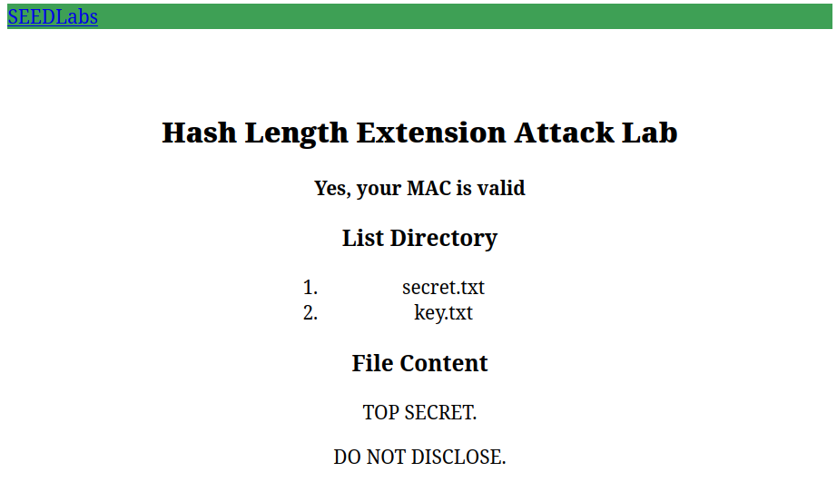
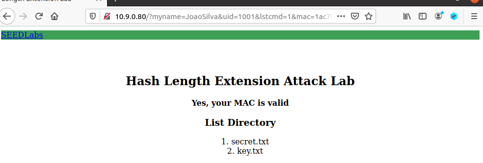

# Hash Length Extension Attack Lab

[https://seedsecuritylabs.org/Labs_20.04/Crypto/Crypto_Hash_Length_Ext/](https://seedsecuritylabs.org/Labs_20.04/Crypto/Crypto_Hash_Length_Ext/)

## Work

Part of the **SSI Course Unit** at [FEUP](https://sigarra.up.pt/feup/en/WEB_PAGE.INICIAL).

**Team** (Group 3):

- João Pedro Rodrigues da Silva [[up201906478]](mailto:up201906478@edu.fe.up.pt);
- António Bernardo Linhares Oliveira [[up202204184]](mailto:up202204184@edu.fe.up.pt);
- Fernando Adriano Ramalho Rocha [[up202200589]](mailto:up202200589@edu.fe.up.pt).

The group has followed the instructions on the lab page, and has documented the process as well as the answers to the questions indicated in the lab tasks.

## Task 1: Send Request to List Files

By using the correct hash and query for the server, a curl got the secret.txt information

```console
earth ~/desktop % echo -n "123456:myname=Antonio&uid=1001&lstcmd=1&download=secret.txt" | sha256sum
0a3f6510d8aec68d8de6b55f5c346db7c0737038aa0e75f6d1491c061b7ae72f  -
earth ~/desktop % curl "http://www.seedlab-hashlen.com/?myname=Antonio&uid=1001&lstcmd=1&download=secret.txt&mac=0a3f6510d8aec68d8de6b55f5c346db7c0737038aa0e75f6d1491c061b7ae72f" > secret.txt
  % Total    % Received % Xferd  Average Speed   Time    Time     Time  Current
                                 Dload  Upload   Total   Spent    Left  Speed
100  1174  100  1174    0     0   148k      0 --:--:-- --:--:-- --:--:--  191k
```

secret.txt displayed in the browser



## Task 2: Create Padding

It's requested that we build padding for the following message:

```console
123456:myname=Antonio&uid=1001&lstcmd=1
```

Length = 39
Padding = 64 - 39 = 25
Length bit = 0x138

```console
"123456:myname=Antonio&uid=1001&lstcmd=1"
"\x80"
"\x00\x00\x00\x00"
"\x00\x00\x00\x00\x00"
"\x00\x00\x00\x00\x00"
"\x00\x00\x00\x00\x00"
"\x00\x00\x00\x01\x38"
```

## Task 3: The Length Extension Attack

In this task, the objective is to first generate a valid MAC for the request:

- `<key>:myname=<name>&uid=<uid>&lstcmd=1`

The following achieved that:


Next we need to construct the padding for the following message with a pair *<keir,uid>* obtained from *key.txt* and the name being my personal name in this case:

`123456:myname=JoaoSilva&uid=1001&lstcmd=1`

Length of message: 41 bytes

Padding: 64 bytes - 41 bytes = 23 bytes including 8 bytes of length field

Length of message in term of bits = 41decimal * 8 = 328 bits =bits in hex 0x0148

SHA256 will be performed in the following padded message:

"123456:myname=JoaoSilva&uid=1001&lstcmd=1"
"\x80"
"\x00\x00\x00\x00\x00\x00\x00\x00\x00\x00"
"\x00\x00\x00\x00"
"\x00\x00\x00\x00\x00\x00\x01\x48"

`Padding: %80%00%00%00%00%00%00%00%00%00%00%00%00%00%00%00%00%00%00%00%00%01%48`

Also, having the MAC of the original message, we can now produce a new MAC for the whole request with the extra download command, using the *length_ext.c* file:

```c
// MAC of the original message M (padded) 
//c97596378ef0314fdc0a8e48402c16f894167e77e5d5d302661d2bcb3a221182


c.h[0] = htole32(0xc9759637);
c.h[1] = htole32(0x8ef0314f);
c.h[2] = htole32(0xdc0a8e48);
c.h[3] = htole32(0x402c16f8);
c.h[4] = htole32(0x94167e77);
c.h[5] = htole32(0xe5d5d302);
c.h[6] = htole32(0x661d2bcb);
c.h[7] = htole32(0x3a221182);
```

```c
// Append additional message
SHA256_Update(&c, "&download=secret.txt", 20);
SHA256_Final(buffer, &c);
```

New MAC produced:


Based on the `<mac>` calculated above, we can now construct a new request that includes the *download* command without using the secret key:

`http://10.9.0.80/?myname=JoaoSilva&uid=1001&lstcmd=1%80%00%00%00%00%00%00%00%00%00%00%00%00%00%00%00%00%00%00%00%00%01%48&download=secret.txt&mac=278dae05f1fa3eb5b39674bc369e6df2e4971d1d1356a7d8a21407cb46d9122b`

Sending this request using the browser, we achieved the objective, revealing the content of the secret.txt:


## Task 4: Attack Mitigation using HMAC

In this task the objective is to fix the mistake made by computing the MAC with HMAC and not by an insecure way like demonstrated by the attack done in task 3.

The first step is to modify the server program by changing the way the MAC is calculated using Python’s *hmac*.

So *real_mac* variable will now be defined in a different way as shown below:

```python

def verify_mac(key, my_name, uid, cmd, download, mac):
    download_message = '' if not download else '&download=' + download
    message = ''
    if my_name:
        message = 'myname={}&'.format(my_name)
    message += 'uid={}&lstcmd='.format(uid) + cmd + download_message
    payload = key + ':' + message
    app.logger.debug('payload is [{}]'.format(payload))
    real_mac =  hmac.new(bytearray(key.encode('utf-8')),
msg=message.encode('utf-8', 'surrogateescape'),
digestmod=hashlib.sha256).hexdigest()


```

The next step is to compute our HMAC for our request.
In this case i will include my personal name on the messsage:

```python

#!/bin/env python3
import hmac
import hashlib
key='123456'
message='myname=JoaoSilva&uid=1001&lstcmd=1'
mac = hmac.new(bytearray(key.encode('utf-8')),
msg=message.encode('utf-8', 'surrogateescape'),
digestmod=hashlib.sha256).hexdigest()
print(mac)
```

Running this python script will give us a valid HMAC for this request that we can forward to our browser and achieve our objective:



When the client and server use HMAC (Hash-based Message Authentication Code) to compute the MAC, the attacker cannot perform a successful length extension attack because HMAC incorporates the secret key into the hash computation in a way that makes it impossible for an attacker to extend the hash value.

In HMAC, the secret key is used to generate two different keys, one for each round of the hash function. This key generation process makes it impossible for an attacker to extend the hash value without knowing the secret key. Even if an attacker could somehow extend the hash value, the resulting MAC would not be valid because the server would detect that the MAC did not match the expected value.
