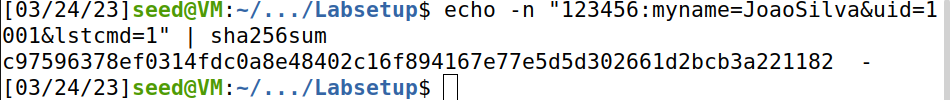

## Task 3: The Length Extension Attack

In this task, the objective is to first generate a valid MAC for the request:

- `<key>:myname=<name>&uid=<uid>&lstcmd=1`

The following achieved that:



Next we need to construct the padding for the following message with a pair *<keir,uid>* obtained from *key.txt* and the name being my personal name in this case:

`123456:myname=JoaoSilva&uid=1001&lstcmd=1`

Length of message: 41 bytes

Padding: 64 bytes - 41 bytes = 23 bytes including 8 bytes of length field

Length of message in term of bits = 41decimal * 8 = 328 bits =bits in hex 0x0148

SHA256 will be performed in the following padded message:

"123456:myname=JoaoSilva&uid=1001&lstcmd=1"
"\x80"
"\x00\x00\x00\x00\x00\x00\x00\x00\x00\x00"
"\x00\x00\x00\x00"
"\x00\x00\x00\x00\x00\x00\x01\x48"

`Padding: %80%00%00%00%00%00%00%00%00%00%00%00%00%00%00%00%00%00%00%00%00%01%48`

Also, having the MAC of the original message, we can now produce a new MAC for the whole request with the extra download command, using the *length_ext.c* file:

```c
// MAC of the original message M (padded) 
//c97596378ef0314fdc0a8e48402c16f894167e77e5d5d302661d2bcb3a221182


c.h[0] = htole32(0xc9759637);
c.h[1] = htole32(0x8ef0314f);
c.h[2] = htole32(0xdc0a8e48);
c.h[3] = htole32(0x402c16f8);
c.h[4] = htole32(0x94167e77);
c.h[5] = htole32(0xe5d5d302);
c.h[6] = htole32(0x661d2bcb);
c.h[7] = htole32(0x3a221182);
```

```c
// Append additional message
SHA256_Update(&c, "&download=secret.txt", 20);
SHA256_Final(buffer, &c);
```

New MAC produced:


Based on the `<mac>` calculated above, we can now construct a new request that includes the *download* command without using the secret key:

`http://10.9.0.80/?myname=JoaoSilva&uid=1001&lstcmd=1%80%00%00%00%00%00%00%00%00%00%00%00%00%00%00%00%00%00%00%00%00%01%48&download=secret.txt&mac=278dae05f1fa3eb5b39674bc369e6df2e4971d1d1356a7d8a21407cb46d9122b`

Sending this request using the browser, we achieved the objective, revealing the content of the secret.txt:


