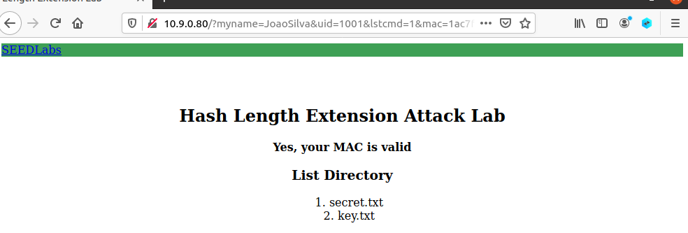

##  Task 4: Attack Mitigation using HMAC

In this task the objective is to fix the mistake made by computing the MAC with HMAC and not by an insecure way like demonstrated by the attack done in task 3.

The first step is to modify the server program by changing the way the MAC is calculated using Python’s *hmac*.

So *real_mac* variable will now be defined in a different way as shown below:

```python

def verify_mac(key, my_name, uid, cmd, download, mac):
    download_message = '' if not download else '&download=' + download
    message = ''
    if my_name:
        message = 'myname={}&'.format(my_name)
    message += 'uid={}&lstcmd='.format(uid) + cmd + download_message
    payload = key + ':' + message
    app.logger.debug('payload is [{}]'.format(payload))
    real_mac =  hmac.new(bytearray(key.encode('utf-8')),
msg=message.encode('utf-8', 'surrogateescape'),
digestmod=hashlib.sha256).hexdigest()


```

The next step is to compute our HMAC for our request.
In this case i will include my personal name on the messsage:

```python

#!/bin/env python3
import hmac
import hashlib
key='123456'
message='myname=JoaoSilva&uid=1001&lstcmd=1'
mac = hmac.new(bytearray(key.encode('utf-8')),
msg=message.encode('utf-8', 'surrogateescape'),
digestmod=hashlib.sha256).hexdigest()
print(mac)
```

Running this python script will give us a valid HMAC for this request that we can forward to our browser and achieve our objective:



When the client and server use HMAC (Hash-based Message Authentication Code) to compute the MAC, the attacker cannot perform a successful length extension attack because HMAC incorporates the secret key into the hash computation in a way that makes it impossible for an attacker to extend the hash value.

In HMAC, the secret key is used to generate two different keys, one for each round of the hash function. This key generation process makes it impossible for an attacker to extend the hash value without knowing the secret key. Even if an attacker could somehow extend the hash value, the resulting MAC would not be valid because the server would detect that the MAC did not match the expected value.
